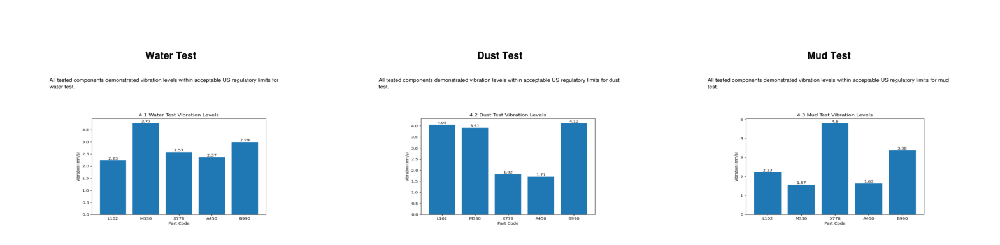
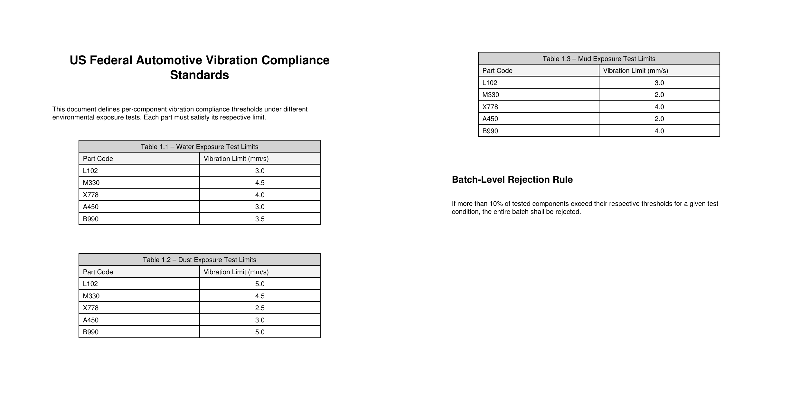

# Multimodal RAG for Compliance Validation

This project builds a layout-aware multimodal RAG pipeline to validate vendor vibration test results against US regulatory thresholds.

The system extracts text, tables, and images from PDFs, preserves their positions, reconstructs document structure, and determines batch-level compliance.

---

## Preview Data Files  (Comparing Bar Charts to Tables with same part names)

### 🔹 Vendor Report  
- Contains vibration test results for multiple parts under different conditions (Water, Dust, Mud).
- Measures only in images and not in texts.
- Generated document with vauge and same names across all 3 test to simulate real document.  
 

📎 [Click here to view the full Vendor PDF](data-reports/vendor_report.pdf)

---

### 🔹 US Regulations Document  
- Defines vibration **threshold limits** for each part under different test conditions.  
- To simulate real documents, threshold values are not given in text.

📎 [Click here to view the full Regulations PDF](data-reports/us_regulations.pdf)

---

##  Exploration Notebooks

### 🔹 Exp 1: Exploring PDF Extractors  
[Open Notebook](https://github.com/7rohxt/ai-learning-hub/blob/main/gen-ai/multi-modal-rag/exp1_pdf_extractors.ipynb)

Extracts text, images, and tables from a sample PDF and reconstructs the layout using positional data.

---

### 🔹 Exp 2: Handling Tables  
[Open Notebook](https://github.com/7rohxt/ai-learning-hub/blob/main/gen-ai/multi-modal-rag/exp2_handling_tables.ipynb)

Focuses on extracting tables correctly without losing structure or duplicating text.

---

### 🔹 Exp 3: Handling Images  
[Open Notebook](https://github.com/7rohxt/ai-learning-hub/blob/main/gen-ai/multi-modal-rag/exp3_handling_images.ipynb)

Appraoch 1 -> Generate Image Summary - Extracts images, preserves their position, and generates captions for chart-based data.  

Approach 2 -> Using CLIP embeddings - Extracts images, generated CLIP image embeddings for direct cross-modal retrieval using text-to-image similarity search.

---

### 🔹 Exp 4: Main RAG Pipeline  
[Open Notebook](https://github.com/7rohxt/ai-learning-hub/blob/main/gen-ai/multi-modal-rag/exp4_main_rag_pipeline.ipynb)

Combines everything — extracts data from both PDFs, compares measurements with thresholds, and outputs compliance results.

---

##  Architecture Overview

- **PyMuPDF** → Extract text and images with bounding box positions  
- **pdfplumber** → Extract structured tables  
- **LLM (GPT-4o)** → Caption charts and extract numeric values  
- **Layout-aware reconstruction** → Merge content by vertical position  
- **Compliance engine** → Compare measurements with thresholds  
- **Rejection rule application** → Determine batch-level decision  

---

##  Sample Output

Input:  "Is the batch compliant under all tests?"  
> Note: Exactly one component measurement was intentionally set above the threshold in the mud test to validate the robustness of the pipeline.

output:  

Overall: Non-Compliant

Test-wise Breakdown:
- Water Test: Compliant.
- Dust Test: Compliant.
- Mud Test: Non-Compliant.

Explanation:
- Mud Test:
  - X778: Measured 4.8 mm/s vs threshold 4.0 mm/s.
  - Violation percentage: 20% (1 out of 5 components).
- According to the Batch-Level Rejection Rule, the entire batch is rejected because more than 10% of tested components exceeded their thresholds in the Mud Test.